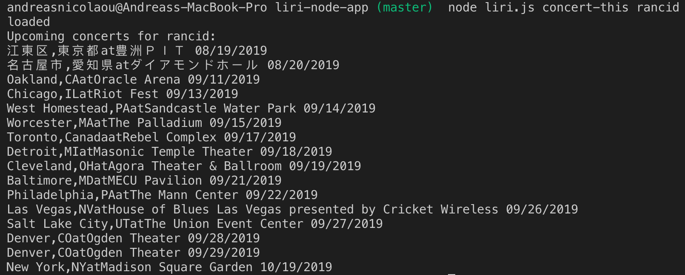
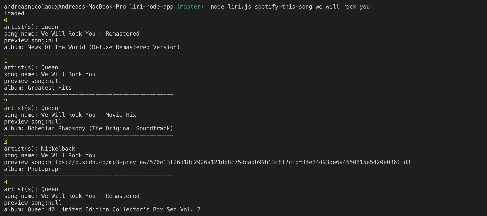
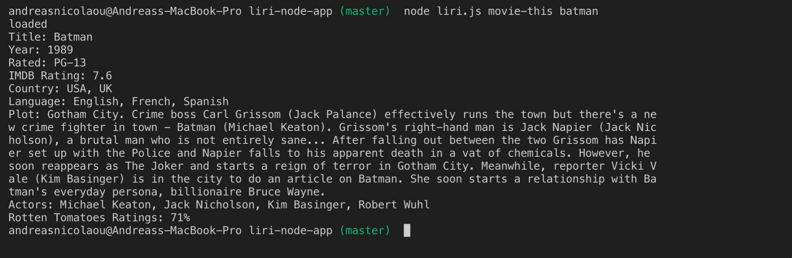
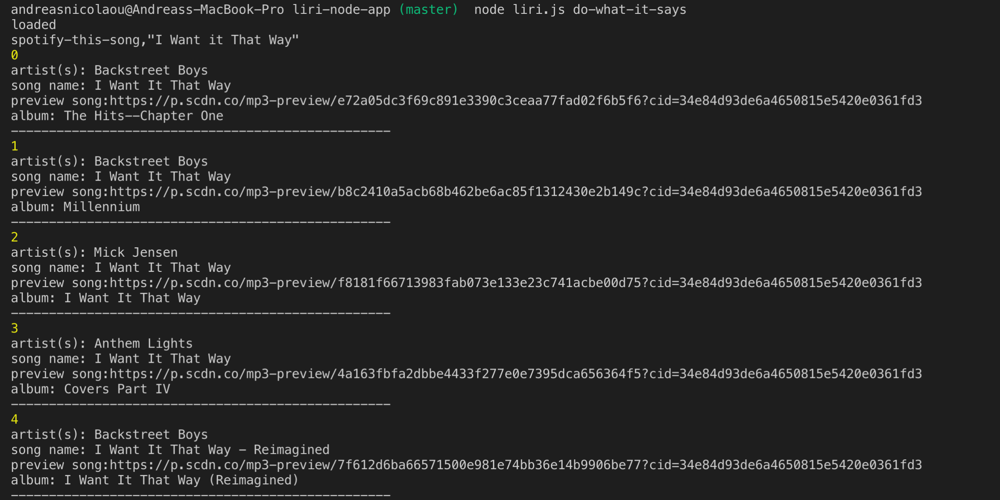

# liri-node-app

## OVERVIEW
Welcome to the Liri app where you can easily request information on your favorite music from artist/song info to upcoming tour dates.  Not a music person?  It's ok!  You can also request info on your favorite movies.

## Instructions
1. Clone repository to your local machine
2. Navigate to repository in your terminal
3. Run npm install
4. After packages are installed enter the following commands (EXAMPLE: node liri.js "concert-this" green day):
    ..* "concert-this" followed by a musical artist will return tour information.
    ..* "spotify-this-song" followed by a musical artist or song name will return album/song information.
    ..* "movie-this" followed by a film title will return movie information.
    ..* "do-what-it-says" followed by nothing will return a sweet, sweet surprise.

### SCREEN SHOTS

